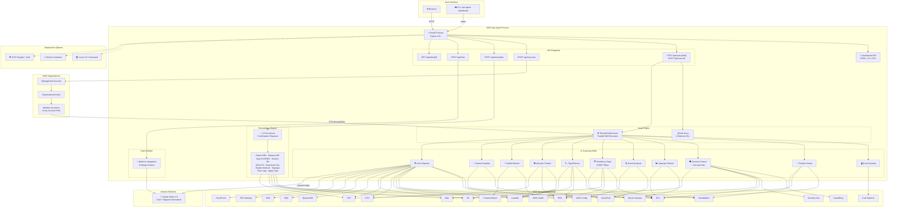

# AWS Ops Agent — Solution Architecture

```mermaid
graph TB
    subgraph "User Interface"
        Browser["🌐 Browser"]
        CLI["⌨️ CLI: ops-agent dashboard"]
    end

    subgraph "AWS Ops Agent Process"
        direction TB
        FastAPI["⚡ FastAPI Server<br/>Python 3.9+"]
        Static["📄 Dashboard SPA<br/>HTML / JS / CSS"]
        
        subgraph "API Endpoints"
            ScanAPI["POST /api/scan/{skill}<br/>POST /api/scan-all"]
            OrgAPI["POST /api/org-scan"]
            RemAPI["POST /api/remediate"]
            ChatAPI["POST /api/chat"]
            JobAPI["GET /api/jobs/{id}"]
        end

        subgraph "Scan Engine"
            JobStore["📋 Job Store<br/>In-Memory Dict"]
            ThreadPool["⚙️ ThreadPoolExecutor<br/>Parallel Skill Execution"]
        end

        subgraph "11 Scanning Skills"
            S1["💰 Cost-Anomaly"]
            S2["🧟 Zombie-Hunter"]
            S3["🛡️ Security-Posture<br/>+ Security Hub"]
            S4["📊 Capacity-Planner"]
            S5["🔍 Event-Analysis"]
            S6["🏗️ Resiliency-Gaps<br/>6 WAF Pillars"]
            S7["🏷️ Tag-Enforcer"]
            S8["⏳ Lifecycle-Tracker"]
            S9["🏥 Health-Monitor"]
            S10["📏 Quota-Guardian"]
            S11["🏗️ Arch-Diagram"]
        end

        subgraph "Remediation Engine"
            RemEngine["🔧 16 Fix Actions<br/>Confirmation Required"]
            RemActions["Delete EBS · Release EIP<br/>Stop EC2/RDS · Restrict SG<br/>Block S3 · Deactivate Key<br/>Enable Multi-AZ · Backups<br/>Flow Logs · Apply Tags"]
        end

        subgraph "Chat Handler"
            ChatHandler["💬 Bedrock Integration<br/>Findings Context"]
        end
    end

    subgraph "Amazon Bedrock"
        Claude["🤖 Claude Haiku 4.5<br/>Chat + Diagram Generation"]
    end

    subgraph "AWS Services (Scanned)"
        EC2["EC2"]
        RDS["RDS"]
        S3svc["S3"]
        Lambda["Lambda"]
        ECS["ECS"]
        VPC["VPC"]
        IAM["IAM"]
        CW["CloudWatch"]
        CT["CloudTrail"]
        Config["AWS Config"]
        GD["GuardDuty"]
        SH["Security Hub"]
        Health["AWS Health"]
        TA["Trusted Advisor"]
        SQ["Service Quotas"]
        CE["Cost Explorer"]
        DDB["DynamoDB"]
        SQS["SQS"]
        SNS["SNS"]
        APIGW["API Gateway"]
        CF["CloudFront"]
    end

    subgraph "AWS Organizations"
        MgmtAcct["Management Account"]
        OUs["Organizational Units"]
        MemberAccts["Member Accounts<br/>Cross-Account Role"]
    end

    subgraph "Deployment Options"
        Local["💻 Local: CLI Command"]
        Docker["🐳 Docker Container"]
        Fargate["☁️ ECS Fargate + ALB"]
    end

    Browser -->|HTTP| FastAPI
    CLI -->|starts| FastAPI
    FastAPI --> Static
    FastAPI --> ScanAPI
    FastAPI --> OrgAPI
    FastAPI --> RemAPI
    FastAPI --> ChatAPI
    FastAPI --> JobAPI

    ScanAPI --> JobStore
    ScanAPI --> ThreadPool
    ThreadPool --> S1 & S2 & S3 & S4 & S5 & S6 & S7 & S8 & S9 & S10 & S11

    S1 --> CE
    S2 --> EC2 & RDS & CW
    S3 --> GD & SH & EC2 & S3svc & IAM
    S4 --> SQ & EC2
    S5 --> CT & Config
    S6 --> EC2 & RDS & VPC & CW
    S7 --> EC2 & RDS & S3svc & Lambda
    S8 --> Lambda & RDS & ECS
    S9 --> Health & TA
    S10 --> SQ & CW
    S11 --> Config & CT & EC2 & RDS & Lambda & ECS & VPC & S3svc & DDB & SQS & SNS & APIGW & CF

    S11 -->|resource data| Claude
    ChatHandler --> Claude
    ChatAPI --> ChatHandler

    RemAPI --> RemEngine
    RemEngine --> RemActions
    RemActions --> EC2 & RDS & S3svc & IAM & VPC

    OrgAPI --> MgmtAcct
    MgmtAcct --> OUs
    OUs --> MemberAccts
    MemberAccts -->|STS AssumeRole| ThreadPool

    FastAPI -.-> Local & Docker & Fargate
```
